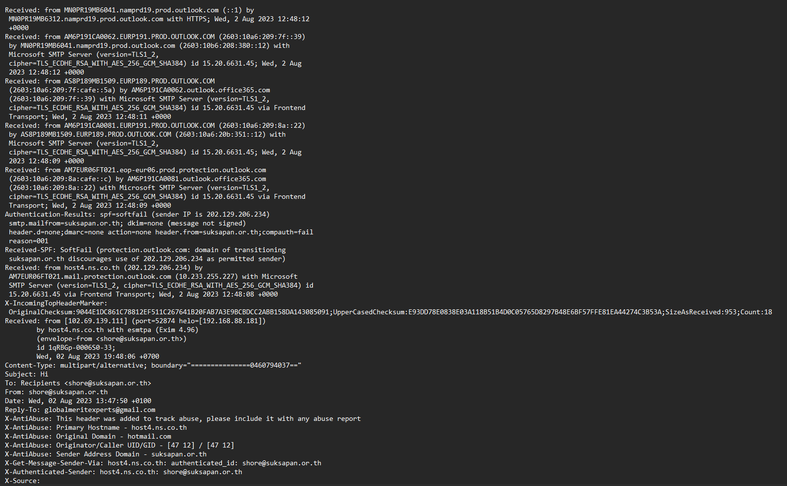
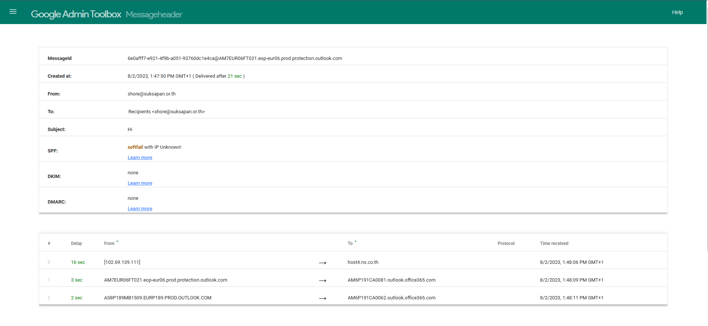
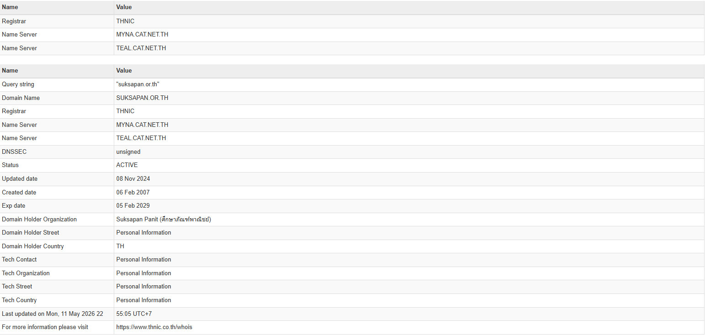
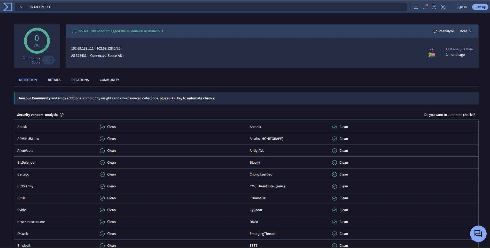
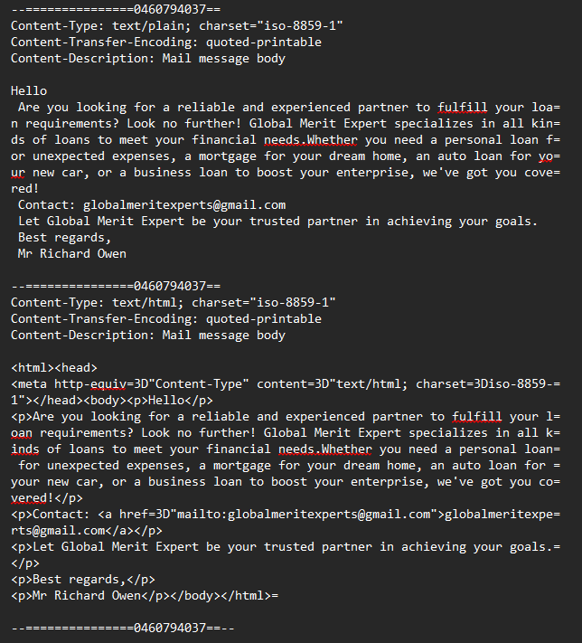

# Phishing Email Analysis – Advance Fee Fraud (Loan Scam)

## Scenario
A suspicious email was received claiming to be from a legitimate organisation, soliciting the recipient to contact a third-party Gmail address regarding loan services. The email was submitted for investigation to determine whether it was malicious and to identify the threat type, attack method, and relevant indicators of compromise.

---

## Tools Used
| Tool | Purpose |
|------|---------|
| Google Admin Toolbox | Email header analysis and relay chain visualisation |
| MXToolbox WHOIS | Sender domain investigation |
| VirusTotal | IP reputation analysis |
| Text Editor (Notepad) | Raw .eml file inspection |

---

## Header Analysis

The raw email headers were extracted from the `.eml` file and analysed using Google Admin Toolbox.



### Authentication Results

| Check | Result | Interpretation |
|-------|--------|----------------|
| SPF | `softfail` | The sending IP `202.129.206.234` is not an authorised sender for `suksapan.or.th` |
| DKIM | `none` | The email was not cryptographically signed — no integrity guarantee |
| DMARC | `none` | No domain policy enforced — domain has no spoofing protection |
| X-SID | `FAIL` | Microsoft Sender ID check failed |
| SCL Score | `5` | Microsoft assessed this as likely spam |



### Key Findings

**SPF Softfail:** The sending IP `202.129.206.234` was flagged as not permitted to send on behalf of `suksapan.or.th`. This indicates either a misconfigured mail server or, more likely, a compromised account being used to send mail from an unauthorised server.

**DKIM None:** The absence of a DKIM signature means the email's integrity cannot be verified. Legitimate organisations almost always sign outbound email with DKIM.

**DMARC None:** No DMARC policy exists for the sending domain, meaning there is no enforcement mechanism to prevent spoofing or impersonation of this domain.

**Reply-To Mismatch:** The most significant indicator. The `From` address is `shore@suksapan.or.th` however the `Reply-To` header is set to `globalmeritexperts@gmail.com`. This means any victim who replies will send their response directly to the attacker's Gmail inbox, not to the legitimate organisation. This is a classic technique used in social engineering attacks.

**Origin IP:** The true origin of the email is `102.69.139.111`, which connected to `host4.ns.co.th` before being relayed through Microsoft Exchange Online Protection into the victim's Office 365 mailbox.

**Relay Chain:**
```
[102.69.139.111] → host4.ns.co.th → AM7EUR06FT021.eop-eur06.prod.protection.outlook.com → Office365
```

---

## Sender Domain Investigation

The sending domain `suksapan.or.th` was investigated using MXToolbox WHOIS.



| Field | Value |
|-------|-------|
| Registrar | THNIC (Thai Network Information Centre) |
| Created | 06 February 2007 |
| Updated | 08 November 2024 |
| Status | Active |
| Organisation | Suksapan Panit |
| Country | Thailand |

### Assessment

The domain `suksapan.or.th` is a legitimate, long-established Thai organisational domain registered in 2007 belonging to Suksapan Panit, a real Thai company. This is not a newly registered lookalike domain created for phishing purposes.

This finding changes the threat assessment significantly. Rather than domain spoofing, the evidence points to a **compromised legitimate email account**. An attacker likely gained unauthorised access to the `shore@suksapan.or.th` account and is using it to send scam emails. Using a legitimate aged domain helps the email bypass spam filters, as the sending domain has an established reputation.

---
IP Reputation Analysis
The origin IP 102.69.139.111 was submitted to VirusTotal for reputation analysis.



Result: No vendors flagged this IP as malicious at the time of analysis.
Assessment: A clean VirusTotal result does not confirm the IP is benign. VirusTotal reflects community-reported detections and newly used IPs — particularly those belonging to compromised legitimate infrastructure — frequently return clean results. This is consistent with the assessment that the sending account was compromised rather than operated from known malicious infrastructure. The IP should still be monitored and blocked at the email gateway as a precautionary measure.

## Email Body Analysis

The email body was extracted from the raw `.eml` file.



The body reads as follows:

> *"Are you looking for a reliable and experienced partner to fulfill your loan requirements? Look no further! Global Merit Expert specializes in all kinds of loans to meet your financial needs. Whether you need a personal loan for unexpected expenses, a mortgage for your dream home, an auto loan for your new car, or a business loan to boost your enterprise, we've got you covered!"*
>
> *Contact: globalmeritexperts@gmail.com*
>
> *Best regards, Mr Richard Owen*

### Assessment

This email contains no malicious URLs or attachments. The attack is entirely social engineering based. This is consistent with an **Advance Fee Fraud (419 Scam)** — a well-documented fraud type where victims are lured into contact under the pretence of a financial service. Once engaged, victims are typically asked to pay upfront fees, taxes, or processing costs to release funds or loans that do not exist.

The use of a vague subject line ("Hi") is deliberate — it does not trigger keyword-based spam filters and encourages the recipient to open the email out of curiosity.

---

## Indicators of Compromise

| Type | Value | Notes |
|------|-------|-------|
| Sender IP | `102.69.139.111` | True origin IP of the email |
| Mail Server IP | `202.129.206.234` | Relay server — host4.ns.co.th |
| Sending Domain | `suksapan[.]or[.]th` | Legitimate Thai domain — likely compromised |
| Sender Address | `shore@suksapan[.]or[.]th` | Compromised account used to send scam |
| Reply-To Address | `globalmeritexperts@gmail[.]com` | Attacker-controlled inbox |
| Attacker Alias | `Mr Richard Owen` | Name used in email body |
| Attacker Organisation | `Global Merit Expert` | Fictitious loan company used as lure |
| Mail Server | `host4.ns[.]co[.]th` | Sending mail server (Exim 4.96) |
| SPF Result | `softfail` | Sending IP not authorised for domain |
| DKIM Result | `none` | Email not cryptographically signed |
| DMARC Result | `none` | No domain policy enforced |
| SCL Score | `5` | Microsoft spam confidence — likely spam |
| X-SID Result | `FAIL` | Microsoft Sender ID check failed |
| Threat Type | Advance Fee Fraud / 419 Scam | Social engineering via email reply |

---

## Verdict

This email is confirmed malicious. It is an **Advance Fee Fraud (419 Scam)** in which an attacker has likely compromised a legitimate email account belonging to a Thai organisation (`suksapan.or.th`) and is using it to send fraudulent loan solicitation emails at scale. The attacker diverts all replies to an attacker-controlled Gmail account (`globalmeritexperts@gmail.com`) using a Reply-To header mismatch.

The use of a legitimate aged domain, combined with the absence of malicious URLs or attachments, is a deliberate evasion technique designed to bypass automated security controls. The attack relies entirely on social engineering to manipulate victims into replying and eventually parting with money.

**Threat Classification:** Advance Fee Fraud / Business Email Compromise (BEC) adjacent  
**Confidence:** High  
**Risk to Recipient:** Medium — no technical exploitation, but financial loss risk if victim engages

---

## Recommended Actions

1. **Block the Reply-To address** `globalmeritexperts@gmail.com` at the email gateway to prevent any outbound communication to the attacker
2. **Flag the sending IP** `102.69.139.111` for monitoring — search email logs for other messages originating from this IP
3. **Search email logs** for other recipients of this campaign within the organisation
4. **Notify the affected user** who received the email — advise them not to respond or provide any personal or financial information
5. **Report the compromised domain** to THNIC (the Thai domain registry) and abuse@suksapan.or.th so the legitimate organisation can investigate and secure their email account
6. **Raise a ticket** for L2 review if any users are believed to have responded to the email
7. **User awareness reminder** — circulate a brief advisory reminding staff to verify sender addresses and be cautious of unsolicited financial offers received via email

---

## References
- [Google Admin Toolbox](https://toolbox.googleapps.com/apps/messageheader/)
- [MXToolbox WHOIS](https://mxtoolbox.com/whois.aspx)
- [VirusTotal](https://virustotal.com)
- [THNIC WHOIS](https://www.thnic.co.th/whois)
